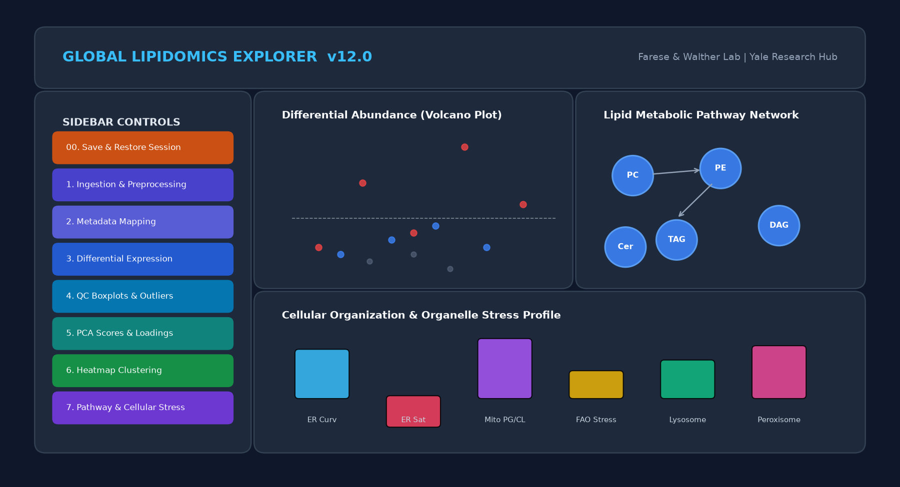

# MT_Global_Lipidomic_Explorer

[](https://github.com/Farese-Walther-Lab/MT_Global_Lipidomic_Explorer/actions/workflows/bootstrap_test.yml)
[](https://cloud.r-project.org/)
[](LICENSE)


**MT_Global_Lipidomic_Explorer** is an interactive web-based software application designed for the processing, quality control, analysis, and visualization of lipidomics datasets. Developed for scientific and clinical research workflows, the application helps researchers extract biological insights from abundance matrices without requiring advanced bioinformatics training.



## Key Features

- **Centralized Data Hub**: Standardized ingestion of lipid abundance tables, automated sample metadata alignment, missing value imputation, and normalization options.
- **Quality Control & PCA**: Diagnostic distribution boxplots and interactive Principal Component Analysis (PCA) plots for cohort clustering and outlier detection.
- **Differential Expression**: Statistical identification of significant lipid changes using moderated t-tests/ANOVA (via `limma`) or standard non-parametric tests.
- **Composition Profiling**: Class-level and species-level abundance distributions represented through stacked barcharts and dynamic donut plots.
- **Longitudinal Tracking**: Cohort filtering and time-course analysis to profile changes across experimental timelines.
- **Pathway & Biosynthetic Analysis**: Integrated Lipid Set Enrichment Analysis (LSEA) and biosynthetic origin functional ratio calculations.
- **Structural Feature Mapping**: Lipid subclass grid visualizers mapping Carbon chain length against Double bond counts to explore desaturation and elongation trends.

## Local Installation & Launch

To run the application locally on your machine, you must have R (version >= 4.4.0) installed.

1. **Clone the Repository**:
   ```bash
   git clone https://github.com/Farese-Walther-Lab/MT_Global_Lipidomic_Explorer.git
   cd MT_Global_Lipidomic_Explorer
   ```

2. **Setup Dependencies**:
   Open R or RStudio and source the environment bootstrap script to install the necessary libraries into a local sandboxed library:
   ```R
   source("00_ENVIRONMENT_SETUP.R")
   ```

3. **Run the App**:
   Run the application launcher script:
   ```R
   source("01_RUN_APP.R")
   ```
   Or launch it directly in R via:
   ```R
   shiny::runApp(".")
   ```

### Native OS Launchers
For zero-terminal execution, use the pre-configured platform wrappers in `/OS`:
- **Windows**: Double-click `OS/Windows/launch_windows.bat` (automatically provisions user-space R 4.4 if missing).
- **macOS**: Double-click `OS/macOS_AppleSilicon/launch_macos.command` (Apple Silicon) or `OS/macOS_Intel/launch_macos.command` (Intel).
- **Linux**: Execute `bash OS/Linux/launch_linux.sh`.

### Docker Container Launch
To run the platform inside an isolated container without altering your local R installation:
```bash
# Build the Docker image
docker build -t mt-global-lipidomic-explorer .

# Run the container (maps to http://localhost:3838)
docker run -p 3838:3838 mt-global-lipidomic-explorer
```
Then open your web browser to `http://localhost:3838`.

## Quickstart with Demo Data
To test the analysis pipeline immediately:
1. Launch the application.
2. Under **`1. Input & Run Analysis`** in the left sidebar, click **Browse...** and select:
   `demo_data/demo_global_lipidomics.xlsx`
3. In the metadata alignment step, click **Confirm Settings**.
4. Click **Run Analysis**.
5. Navigate through the analysis tabs: **Quality Control & PCA**, **Differential Expression**, **Composition**, **Lipid Pathways**, and **Cellular Organization**.

## Repository Structure

- `app.R`: Main application entry point (`shiny::runApp(".")`).
- `00_ENVIRONMENT_SETUP.R`: Multi-OS sandbox environment bootstrapper.
- `01_RUN_APP.R`: Universal application launcher script.
- `02_DIAGNOSTIC_REPORT.R`: System configuration audit and dependency diagnostic tool.
- `pipeline_math_proof_stacked.R`: Self-contained mathematical proof and biostatistical audit pipeline.
- `DESCRIPTION`: R dependency declarations and project metadata.
- `/R`: Core Shiny UI/Server architecture and modular reactive spokes (`1` to `99`).
- `/docs`: Technical specifications, user guide, and peer-review audit documentation:
  - [01_input_data_specification.md](docs/01_input_data_specification.md): Input spreadsheet layouts and metadata mappings.
  - [02_reactive_architecture.md](docs/02_reactive_architecture.md): Centralized reactive orchestrator and module spokesman API.
  - [03_session_persistence.md](docs/03_session_persistence.md): Session state serialization and restoration lifecycles.
  - [04_statistical_methodology.md](docs/04_statistical_methodology.md): Skewness routing rules, parametric and non-parametric tests.
  - [05_multi_os_bootstrapping.md](docs/05_multi_os_bootstrapping.md): Multi-OS local runtime installs and proxy bypasses.
  - [06_developer_contributing_guide.md](docs/06_developer_contributing_guide.md): Development standards, WYSIWYG plot layouts, and test procedures.
  - [07_diagnostic_history.md](docs/07_diagnostic_history.md): Technical troubleshooting logs and workarounds.
  - [08_user_manual.md](docs/08_user_manual.md): End-user quickstart guide, UI walkthroughs, and step-by-step tutorials.
  - [AUDIT_PROMPT_CRITICAL_MATHEMATICAL_ANALYSIS.md](docs/AUDIT_PROMPT_CRITICAL_MATHEMATICAL_ANALYSIS.md): Comprehensive biostatistical reviewer audit prompt.
- `/OS`: Platform-specific configuration environments and shell scripts (Windows, macOS Intel/Apple Silicon, Linux).
- `/data`: Built-in ontological lipid dictionaries, biosynthetic pathway links, and gene mappings.
- `/demo_data`: Standardized sample datasets for immediate testing across analysis modes.
- `/tests`: Automated test suite verifying syntax, session persistence, pathway logic, statistical engine, and targeted fallbacks.

## Community & Contributing

We welcome contributions and feedback from the scientific community:
- [CONTRIBUTING.md](CONTRIBUTING.md): Contribution guidelines, pull request checklists, and coding conventions.
- [CODE_OF_CONDUCT.md](CODE_OF_CONDUCT.md): Contributor Covenant v2.1 code of conduct.
- [SECURITY.md](SECURITY.md): Security policy and responsible vulnerability reporting.
- [CHANGELOG.md](CHANGELOG.md): Version release history and migration notes.

## Citation

Please cite this software using the metadata provided in the [CITATION.cff](CITATION.cff) file. You can copy the reference format by clicking the "Cite this repository" button in the sidebar of the GitHub repository.

## License

This project is licensed under the MIT License - see the `LICENSE` file for details.