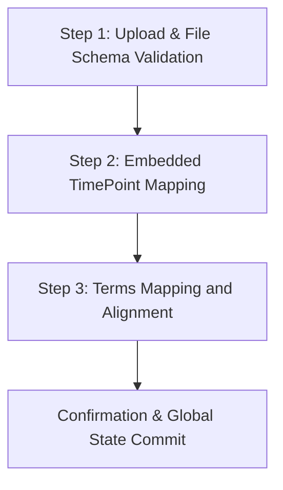

# Input Dataset Layout and Metadata Mapping Specification

This document defines the strict layout requirements, formatting rules, and metadata schemas governing data ingestion, parsing, and alignment within the application.

---

## 1. Primary Abundance Dataset Formats

The application supports two main categories of lipidomics datasets. Data must be uploaded as a spreadsheet (.xlsx or .csv) adhering to the specifications below:

### A. Global Lipidomics Profiles
*   **Abundance Matrix**: Contains absolute intensity values or normalized peak areas for hundreds of lipid species across multiple samples.
*   **Lipid Identifier Column**: The first column of the spreadsheet must contain unique lipid species names using standard IUPAC-like abbreviations (e.g., `PC(16:0/18:1)`, `PE(18:0_20:4)`, `TG(16:0_18:1_18:2)`). 
*   **Sample Columns**: All subsequent columns must represent individual biological or technical replicates. Headers must correspond exactly to the sample names registered in the metadata sheet.
*   **Data Integrity**: Cell values in the abundance matrix must be strictly numeric. Empty cells or text values (e.g., "ND" or "NaN") will be processed and imputed during data ingestion.

### B. Lipid Mediators Profiles
*   **Abundance Matrix**: Typically represents low-abundance targeted lipid panels (e.g., oxylipins, endocannabinoids).
*   **Sparse Arrays**: Data matrices frequently contain a high proportion of missing values or values below the limit of detection (LOD). 
*   **Ingestion Logic**: Automatically flags zero or near-zero values, routing them through specialized sparse filtering and normalizations distinct from global lipidomics profiles.

---

## 2. Metadata Table Specification

Every analysis requires a metadata map detailing the experimental design. This map must reside on a separate sheet inside the uploaded Excel workbook or as a separate CSV file.

### Required Column Headers
The metadata table must contain the following columns (headers are case-insensitive):

1.  **`FullName`**: Unique sample identifiers. Values must match the sample column headers in the abundance dataset exactly.
2.  **`Group1Term`**: The primary experimental grouping or treatment status (e.g., `Control`, `Treated`, `Knockout`).
3.  **`Group2Term`**: The biological cohort, tissue origin, or species designation (e.g., `WildType`, `Mutant`).
4.  **`ReplicateTerm`**: Numeric indices mapping replicates within groups (e.g., `1`, `2`, `3`).
5.  **`PatientTerm`**: Patient or subject identifiers. Required for longitudinal pairing or repeated-measures designs.
6.  **`TimePointTerm`**: Timepoints or treatment durations (e.g., `0h`, `24h`, `Day_7`). Required for longitudinal and kinetic analyses.

---

## 3. Metadata Ingestion and Interactive Mapping

Data parsing and normalization are executed in a sequential 3-step validation pipeline within the centralized orchestrator module (`1_shared_data_module.R`):

### Step 1: Upload and File Schema Validation
*   **User-Initiated Dataset Ingestion**: To ensure the application launches cleanly with the Welcome/Quick Start user guide and prevents unintended dataset hydration, startup scanning of the local `data/` directory for raw experimental spreadsheets is disabled. All datasets must be explicitly uploaded by the user.
*   **Ingestion Formats**: Both Excel workbooks (`.xlsx` or `.XLSX`) and comma-separated value files (`.csv` or `.CSV`) are parsed to separate the abundance matrix from the metadata table.
*   **Header Verification**: The script verifies that all sample column headers in the abundance matrix have matching entries in the `FullName` column of the metadata registry.
*   **Strict Filtering**: Non-matching sample columns are automatically excluded from subsequent processing.

### Step 2: Embedded TimePoint Mapping
*   In designs where timepoint designations are embedded directly inside the raw sample names (e.g., `WT_Control_Day3_Rep1`), the uploader provides a regex extraction interface.
*   The user can define the prefix patterns (e.g., `Day`, `Hr`, `Wk`) used by the parser to extract timecourse variables and map them to the reactive `TimePointTerm` vector.
*   This mapping is updated in real-time without requiring manual validation.

### Step 3: Terms Mapping and Alignment
*   Raw labels imported from the metadata sheet are displayed in an interactive terms alignment panel.
*   Users align raw terms to standardized experimental groups (e.g., mapping `Ctrl_Group_A` and `Control_Rep` to a unified reference level `Control`).
*   This alignment step builds the contrast design matrix used by downstream hypothesis testing engines, ensuring that custom text labels do not break statistical models.

---

## 4. Lipid Species & Modification Parsing Rules

When raw lipid lists are loaded, the Data Hub parses individual species names to extract their corresponding hyperclass, subclass, and any dynamic chemical modifications (e.g. ether linkage, plasmalogen, or dihydro chains).
*   **Subclass Splits**: Users can toggle subclasses to split dynamically based on their modifications (e.g. splitting `GP_PE` into `GP_PE` (Standard), `GP_PE_E` (Ether), and `GP_PE_P` (Plasmalogen)).
*   **Dynamic Selector Integrity**: To prevent newly split subclasses, hyperclasses, or targeted single species from being unchecked by default during uploader re-runs or filter selections, the system employs tracking registries (`prev_hyperclass_choices`, `prev_subclass_choices`, `prev_lm_species_choices`) that identify and automatically select new divisions.

---

## 5. Preprocessed & Imputed Dataset Export

Directly accessible via the **Download Imputed CSV** button in the Data Hub (`1_shared_data_module.R`), users can export the fully preprocessed dataset. The export incorporates the complete 6-stage bioinformatics pipeline:
1. **Sample Selection & Outlier Filtering**: Applies user-configured sample exclusions and ER outlier filtering.
2. **Per-File Zero-to-Missing Detection**: Identifies non-detects ($\le 0$) and tags them as missing values representing left-censored detection limits.
3. **Log2 Scale Transformation**: Maps linear intensities into $\log_2$ space for variance stabilization.
4. **Left-Censored Missing Value Imputation (QRILC)**: Imputes missing values below the limit of detection using Quantile Regression for Left-Censored Data.
5. **Sample-Wise Abundance Normalization**: Normalizes sample-level intensity distributions across active cohorts.
6. **Restitution to the Linear Abundance Scale**: Converts data back to the linear abundance scale with finite numerical bounds, outputting an analysis-ready matrix suitable for external tools (R, Python, GraphPad Prism).

