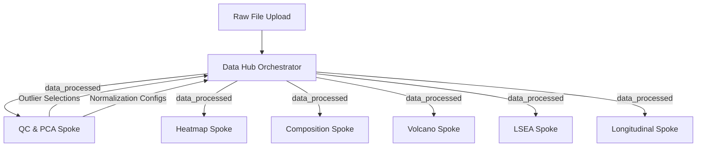

# Centralized Reactive Data Hub and Modular Spoke Architecture

This document describes the application's reactive programming model, the orchestrator-spoke pattern, and the reactive data stream specifications.

---

## 1. Centralized Data Orchestrator (The Hub)

To guarantee a single source of truth and prevent redundant calculations, the application routes all data modifications through a centralized orchestrator module: the **Data Hub** ([1_shared_data_module.R](../R/modules/1_shared_data_module.R)).



### Core Responsibilities of the Data Hub
*   **File Parsing**: Importing raw data sheets and verifying schemas.
*   **Log-Transformation**: Converting raw abundance intensities to the $\log_2$ scale.
*   **Imputation**: Resolving missing values using zero imputation or non-parametric algorithms (e.g., LCMD).
*   **Outlier Filtering**: Excluding samples flagged as outliers by the user.
*   **Normalization**: Executing centering normalizations (median centering, total area normalization).
*   **Metadata Integration**: Compiling parsed grouping variables into design matrices.

---

## 2. Reactive Data Stream Registry

The Data Hub exports a named list of reactive values to the global application state. Spoke modules subscribe to these reactives to drive visual renderings:

| Reactive Symbol | Output Data Type | Description |
| :--- | :--- | :--- |
| `rawData()` | `matrix` (numeric) | The raw abundance matrix directly parsed from the spreadsheet. |
| `data_processed()` | `matrix` (numeric) | The fully filtered, normalized, and imputed $\log_2$ abundance matrix. |
| `all_metadata()` | `data.frame` | Standardized sample metadata table containing parsed grouping columns. |
| `annotationData()` | `data.frame` | Lipid class annotations containing systematic class, subclass, and subclass abbreviations. |
| `species_color_map()` | `character` vector | Named color mappings binding lipid species to global aesthetic palettes. |
| `class_color_map()` | `character` vector | Named color mappings binding lipid classes to global aesthetic palettes. |
| `all_numeric_columns()` | `character` vector | Registry of numeric sample columns from the raw dataset, used to validate outlier selections. |
| `stats_detail_text()` | `reactiveVal` (character) | Console printout text containing mathematical equations, parameters, and statistical logs. |
| `stats_detail_type()` | `reactiveVal` (character) | Mode flag (`"text"` or `"heatmap_formulas"`) controlling the layout of the Statistics console tab. |
| `stats_detail_html()` | `reactiveVal` (HTML tag list) | Rich interactive HTML fragments (e.g. collapsible condensed class formulas). |
| `selected_violin_lipids()` | `reactiveVal` (character) | Reactive feature selection bridge transferring selected lipid species from Heatmap to Violin Plots. |

---

## 3. Module Dependency and Communication (Spokes)

Visualization and analytical modules (`2_qc_boxplot_module.R`, `4_heatmap_module.R`, `5_barchart_module.R`, etc.) act as read-only consumers ("Spokes").

### Data Propagation Rules
1.  **Read-Only Consuming**: Spoke modules must never edit the reactive values returned by the Hub. Plots and tables must bind to `shared_data$data_processed()` and `shared_data$all_metadata()` as static references.
2.  **Downstream Parameter Routing**: If a Spoke module configuration affects the dataset (e.g., toggling outlier samples in the QC module, or changing normalization methods), it must return its configuration reactives back to the Hub via its server function return list.
3.  **Recalculation Loop**: The Hub observes these Spoke configuration reactives, recalculates `data_processed()`, and broadcasts the updated stream to all Spokes, triggering automatic plot updates.

---

## 4. System-Wide Aesthetic Consistency & Apply-Triggered Controls

To prevent color mapping mismatches and reactive rendering lag across tabs, the application uses a centralized color map dictionary injected from the Hub:
*   **Centralized Global Color Store**: `global_color_map` is initialized in `server.R` and managed via `shared_data$global_color_map()`. It maintains synchronized color mappings for `Group1`, `Group2`, composite `Group1 & Group2`, and `Lipid Class` categories.
*   **Cross-Tab Aesthetic Binding**: Plot rendering functions across **PCA Score Plots**, **Heatmap Violin View**, **LogRatio Violin Tab**, **Functional Ratio / FLA Tab**, **Structural Analysis Tab**, **QC Boxplots**, and **Cellular Organization** bind their color fills directly to this global dictionary:
    ```R
    # Example: Manual scale color mapping in ggplot2 using centralized store
    scale_fill_manual(values = shared_data$color_maps()[[c_var]])
    ```
    * In **Cellular Organization** (`14_cellular_org_module.R`), `active_color_map()` dynamically resolves colors across single (`Group1`, `Group2`, `TimePoint`) or composite (`Combined_Grouping`) dimensions, guaranteeing complete color synchronization when multiple grouping variables are selected simultaneously.
*   **Apply-Triggered Color Customization (Lag Prevention)**: 
    To eliminate browser freezes and reactive loop oscillations when customizing colors for datasets with many violins:
    * **Sidebar Panel 8 ("8. Change Color")**: Uses an **"Apply Color Changes"** button (`btn_apply_colors`). Color pickers update a draft state without triggering intermediate plot re-renders until the user clicks Apply.
    * **LogRatio Violin Plot Tab**: Uses an **"Apply Colors to Violins"** button (`btn_apply_violin_colors`). Heavy plot grid rendering occurs only when applied.


