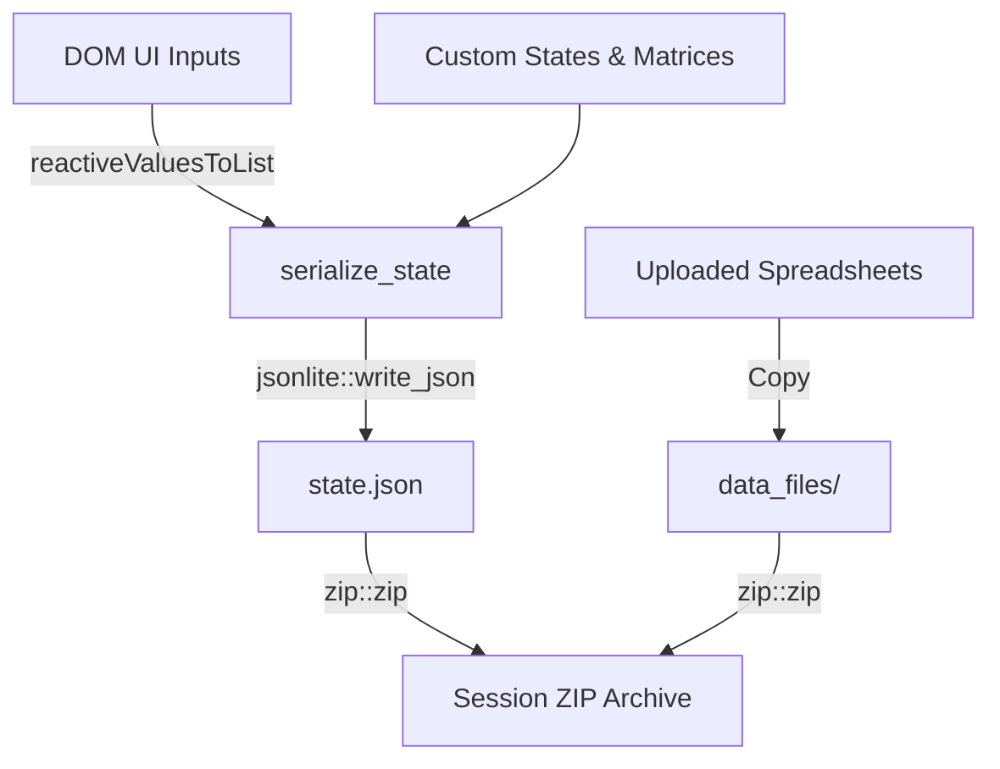
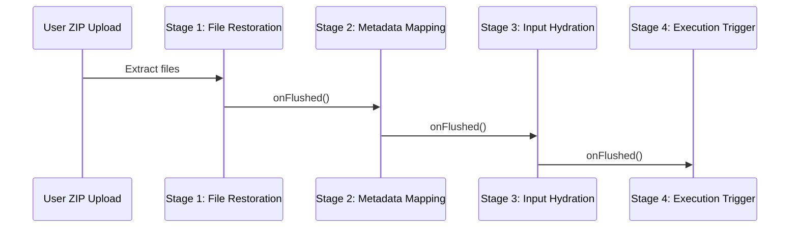

# Session State Serialization and JSON Packaging Protocol

This document details the serialization pipeline, JSON payload structure, and asynchronous 4-stage restoration lifecycle of the persistence system.

---

## 1. Serialization Pipeline (`serialize_state()`)

The application serializes all active UI configurations and custom data matrices into a single structured list. This list is then compiled into a compressed JSON payload:



### Step 1: Input Harvesting
The serializer loops through `global_session$input` to extract active inputs using `reactiveValuesToList(global_session$input)`.

### Step 2: Exclusion Filtering
To prevent session corruption and keep payload sizes minimal, the serializer filters out buttons, file inputs, and transient DataTable states using regex patterns:
```R
excl_patterns <- c("import_session_file", "export_session_btn", "files", "openMetadataMappingBtn", "runAnalysis", "selectAll", "unselectAll", "authorizeMetadata", "remove_", "treat_")
```

### Step 3: Payload Structuring
The filtered inputs are packaged with custom data frames and state objects:
*   **`inputs`**: Cleaned UI configurations.
*   **`metadata`**: Active schemas, timepoint prefixes, and terms alignment tables.
*   **`color_shape`**: User-defined color palettes.
*   **`longitudinal`**: Custom cohort trajectories and timecourse groupings.
*   **`uploads`**: Absolute path registry referencing the active raw spreadsheets.

---

## 2. Session ZIP Archive Schema

An exported session is packaged as a `.zip` file containing two main items:
1.  **`state.json`**: The serialized state list.
2.  **`data_files/`**: A folder containing raw dataset spreadsheets copies. This ensures the app can re-parse the raw data if the user modifies metadata mappings or changes statistical methods.

---

## 3. The 4-Stage Session Restoration Lifecycle

Because Shiny is reactive, loading inputs simultaneously can trigger out-of-order executions, leading to app crashes. The app resolves this by using an asynchronous 4-stage restoration cycle hooked to Shiny's flush cycles (`session$onFlushed`):



### Stage 1: File Restoration
*   The ZIP archive is extracted to a temporary directory.
*   The raw spreadsheets are copied back to the application's upload folder (`user_uploads/`).
*   If a dataset is missing from the package, the app halts restoration and displays a modal prompt asking the user to re-upload the missing file.

### Stage 2: Metadata Mapping
*   Restores metadata tables, unique columns, timepoint maps, and custom color selections.
*   Triggers the metadata validation event, rebuilding the design matrix in the background.

### Stage 3: Input Hydration
*   The app loops through the saved input variables and updates the UI elements using `update_input_generic()`.
*   **JSON Serialization handling**: If the input variable ID ends with `_json`, `update_input_generic()` automatically checks if the saved value is a list or character vector. If so, it encodes the value into a JSON string before applying it to the text input widget. This prevents `[object Object]` values from being set in the text inputs, ensuring clean hydration.
*   **Backward Compatibility Mapping**: To load sessions from older versions of the app, the loader automatically maps legacy inputs:
    *   *Significance Thresholds*: Maps `noSigThreshold` to `applySigThreshold`.
    *   *Grid Sizing*: Detects legacy `gridLabelSize` settings and maps them to the new sliders (`gridStarsSize = gridLabelSize * 2` and `gridPvalSize = gridLabelSize`) when loading older session archives.
    *   *Heatmap Control Synchronization*: Maps `showHeatmapNumbers` and `showHeatmapNumbers_sd_clone` to maintain bi-directional state synchronization upon session restoration.

### Stage 4: Execution Trigger
*   Triggers the primary analysis pipeline by incrementing `run_analysis_trigger_val()`. This simulates a user clicking the confirm button, refreshing all downstream spoke plots and tables.

---

## 4. Complex State Serialization in Modules (Lipid Pathways)

To serialize complex layout customization structures (such as coordinates, custom nodes, added/removed edges, and node position overrides) without making custom changes to the core session state engine, the **Lipid Pathways** module converts these states to JSON strings and stores them in hidden text inputs:
*   `active_classes_json`: Vector of active lipid classes.
*   `custom_nodes_json`: Key-value map of user-added custom nodes with their coordinates.
*   `added_edges_json`: Array of source-target coordinate pairs for custom edges.
*   `removed_edges_json`: Array of source-target coordinate pairs for deleted edges.
*   `position_overrides_json`: Key-value map of custom coordinate overrides for standard nodes.

During **Stage 3: Input Hydration**, the core deserializer restores these hidden input fields as standard text values. The module's server reactively parses these JSON strings back into structured R lists, updating the Plotly metabolic graph instantly without requiring custom serialization/hydration hooks in the core project.

*   **State Hydration**: To restore the state of the pathway correlation, correlation explorer, BQC sample selectors, heatmap controls (`condenseRows`, `condenseRowsSD`, `showHeatmapNumbers`, `showHeatmapNumbers_sd_clone`), and transferred violin lipids (`heatmap_violin_lipids_select`, `selected_violin_lipids`, `violin_sample_mode`, `violin_baseline_group`, `violin_x_order`), their servers hook to `shared_data$get_restored_input()` on startup or dynamic render cycles.
*   **Dynamic Updates**: Observers and render functions dynamically update the selectors (`nomenclature_species`, `corr_category`, `corr_type`, `corr_method`, `r_filter`, `cluster_heatmap`, `star_size`, `bqcSamples`, `heatmap_violin_lipids_select`, `select_sn_chains`, `violin_sample_mode`, `violin_baseline_group`, `violin_x_order`) using `updateSelectInput`, `updateCheckboxInput`, `updateSliderInput`, `sortable::rank_list`, or `renderUI` selections to align with the restored session state, preventing infinite recalculation loops.
