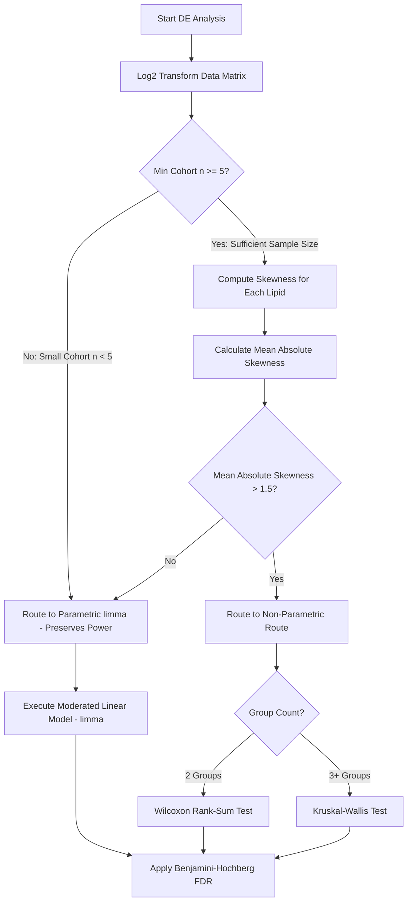

# Statistical Routing Engine and Mathematical Models

This document details the mathematical algorithms and decision-making logic used by the automatic statistical routing engine.

---

## 1. Asymmetry Assessment and Routing Logic

When "Automatic mode" is selected as the Differential Expression (DE) method, the engine dynamically evaluates skewness across all lipid species to route analysis to either a parametric moderated linear model or non-parametric ranks tests.

### A. Skewness Equation
For each lipid species $i$ across all samples $j \in \{1, \dots, N\}$:
$$\text{Skewness}_i = \frac{\frac{1}{N} \sum_{j=1}^{N} (x_{ij} - \mu_i)^3}{\sigma_i^3}$$
Where:
*   $x_{ij}$ represents the $\log_2$-transformed abundance of lipid $i$ in sample $j$.
*   $\mu_i$ is the sample mean of lipid $i$.
*   $\sigma_i$ is the sample standard deviation of lipid $i$.

### B. Mean Absolute Skewness
The global asymmetry of the dataset is evaluated as the average of the absolute skewness values:
$$\text{Mean Absolute Skewness} = \frac{1}{M} \sum_{i=1}^{M} |\text{Skewness}_i|$$
Where $M$ is the total number of lipid species.

---

## 2. Statistical Routes and Decision Rules

The engine dynamically evaluates cohort sample size and global asymmetry using a dual-gate decision rule:

### Sample Size Guard ($\min(n_{\text{cohort}}) < 5$)
*   **Rule**: When any compared cohort has fewer than 5 biological replicates (e.g. typical experimental triplicates $n=3$), the engine **strictly preserves parametric moderated linear modeling (`limma`)**.
*   **Rationale**: The theoretical minimum possible two-tailed Wilcoxon rank-sum $p$-value for $n_1=3, n_2=3$ is $p_{\min} = 2 / \binom{6}{3} = 0.10$. Under multiple testing correction (BH-FDR), *no feature can ever achieve significance* ($p_{\text{adj}} < 0.05$). `limma`'s Empirical Bayes variance shrinkage stabilizes residual variances across the lipidome and preserves statistical discovery in small cohorts.

### Route A: Parametric Moderated Linear Modeling ($\text{Mean Absolute Skewness} \le 1.5$ or $\min(n) < 5$)
*   **Test**: Moderated t-statistics and empirical Bayes shrinkage using the `limma` framework.
*   **Assumption**: Moderation borrows variance information across all lipid features, making the test robust for small sample sizes and symmetric log-normal distributions.

### Route B: Non-Parametric Framework ($\text{Mean Absolute Skewness} > 1.5$ AND $\min(n) \ge 5$)
*   **Test Selection**:
    *   **Two-Group Comparisons**: Evaluated via the **Wilcoxon rank-sum test**.
    *   **Multi-Group Comparisons** (3 or more groups): Evaluated via the **Kruskal-Wallis test**.
*   **Assumption**: With sufficient sample size ($n \ge 5$), rank-based tests robustly identify shifts in heavily skewed or outlier-dominated distributions without assuming normality.

---

## 3. Multiple Testing Correction

Raw p-values are adjusted using the Benjamini-Hochberg False Discovery Rate (BH-FDR) method:
$$p_{\text{adj}} = \min\left(1, \frac{M \cdot p_k}{k}\right)$$
Where $p_k$ is the $k$-th sorted raw p-value.

---

## 4. UI Reporting & Condensed Class Formulas

The routing decisions and statistical metrics are displayed in the application interface:
1.  **Dynamic Plot Captions**: Captions below plots (e.g., Volcano, Heatmap, and Violin plots) update dynamically to report the applied statistical test, significance evaluation mode (FDR adjusted vs raw), and active comparison groups.
2.  **Statistics Console**: The **Statistics** tab displays computed skewness scores, reference selections, degrees of freedom, and p-value corrections.
3.  **Condensed & Uncondensed Heatmap Cell Formulas**: Depending on the active row aggregation mode and sample grouping selection, numeric cell values and journal captions evaluate 4 distinct mathematical formulations:
    *   **Scenario 1: Class Standard Deviation (SD)**:
        $$\text{SD}_{C, j} = \sqrt{\frac{1}{N-1} \sum_{i=1}^N (x_{s_i, j} - \bar{x}_{C, j})^2} \quad [N > 1], \quad \text{SD}_{C, j} = 0 \quad [N = 1]$$
    *   **Scenario 2: Class Average (Mean)**:
        $$\bar{x}_{C, j} = \frac{1}{N} \sum_{i=1}^N x_{s_i, j}$$
    *   **Scenario 3: Uncondensed Single Samples View**:
        $$Z_{i, j} = \frac{x_{i, j} - \mu_i}{\sigma_i} \quad \text{or relative row range scaling } [0, 100]$$
    *   **Scenario 4: Uncondensed Merged Groups View**:
        $$\bar{x}_{i, g} = \frac{1}{M_g} \sum_{k=1}^{M_g} x_{i, k}$$
    *   **Unfiltered vs. Filtered Scope**: Unfiltered views evaluate all detected species; Filtered views restrict evaluation strictly to significant differentially abundant species satisfying $P < P_{\text{thresh}}$ and $|\log_2\text{FC}| \ge \text{FC}_{\text{thresh}}$.

---

## 5. Lipid Pathway-Level Significance Testing

In the **Lipid Pathways** visualization module, significance is evaluated at the lipid class level:
1.  **Total Class Abundance**: For each lipid class $c$, raw total abundance is calculated as the sum of the linear abundances ($2^x$, where $x$ is the processed $\log_2$ intensity) of all detected lipid species belonging to class $c$.
2.  **Logarithmic Scaling**: The total class abundance is then $\log_2$-transformed:
    $$y_{cj} = \log_2(\text{Abundance}_{cj} + 1)$$
    for each sample $j$.
3.  **Two-Sample T-Test**: A standard two-sample t-test (unpaired, unequal variance / Welch's t-test) is performed on $y_{cj}$ comparing the Comparison group samples against the Reference group samples.
4.  **Multiple Testing Correction**: The raw p-values for all active classes on the map are corrected using the Benjamini-Hochberg (FDR) method, allowing users to threshold the map based on raw or FDR-adjusted values.
5.  **Class-Level Saturation Changes**:
    *   **Sample-Level Saturation Ratio**: For each sample $j$, the abundance-weighted saturation ratio of class $c$ is computed as:
        $$S_{cj} = \frac{\sum_{i \in c} A_{ij} \cdot \text{sat}_i}{\sum_{i \in c} A_{ij} \cdot (\text{sat}_i + \text{unsat}_i) + 1\text{e-}9}$$
        where $A_{ij} = 2^{x_{ij}}$ is the linear abundance of lipid species $i$ in sample $j$, and $\text{sat}_i, \text{unsat}_i$ are the counts of saturated/unsaturated chains.
    *   **Saturation Log2FC**:
        $$\text{Saturation Log2FC}_c = \log_2\left( \frac{\text{Mean}(S_{cj} \in \text{Comparison}) + 1\text{e-}9}{\text{Mean}(S_{cj} \in \text{Reference}) + 1\text{e-}9} \right)$$
    *   **Saturation Z-score**:
        $$\text{Saturation Z-score}_c = \frac{\text{Mean}(S_{cj} \in \text{Comparison}) - \text{Mean}(S_{cj} \in \text{Reference})}{\sigma(S_{cj} \text{ across all samples})}$$

---

## 6. Cellular Organization & Subcellular Stress Calculations

In the **Cellular Organization** visualization module, organelle-specific stress indicators and cellular trajectories are computed at the sample level:

### A. Subcellular Organelle Stress Indices
1.  **ER Curvature Stress**:
    $$\text{ER Curvature} = \frac{\sum \text{Value}[\text{subclass} == \text{"GP\_PE"}]}{\sum \text{Value}[\text{subclass} == \text{"GP\_PC"}] + 1\text{e-}9}$$
2.  **ER Saturation Score (Symmetric Log2 Ratio)**:
    $$\text{ER Saturation} = \log_2\left( \frac{\sum \text{Value}[\text{subclass} == \text{"GP\_PC"} \text{ and } \text{Total\_DB} == 0] + 1\text{e-}9}{\sum \text{Value}[\text{subclass} == \text{"GP\_PC"} \text{ and } \text{Total\_DB} > 0] + 1\text{e-}9} \right)$$
    *Symmetric around 0; positive values indicate SFA enrichment ( membrane rigidification), whereas negative values indicate PUFA/double-bond enrichment.*
3.  **Mitochondrial PG/CL Ratio**:
    $$\text{Mito PG/CL} = \frac{\sum \text{Value}[\text{subclass} == \text{"GP\_PG"}]}{\sum \text{Value}[\text{subclass} == \text{"GP\_CL"}] + 1\text{e-}9}$$
4.  **FAO Acylcarnitine Stress (Permille)**:
    $$\text{FAO Stress} = \left( \frac{\sum \text{Value}[\text{subclass} == \text{"FA\_ACar"}]}{\sum \text{Value} + 1\text{e-}9} \right) \times 1000$$
5.  **Lysosomal BMP Mass (%)**:
    $$\text{Lysosomal BMP} = \left( \frac{\sum \text{Value}[\text{subclass} \in \{\text{"GP\_BMP"}, \text{"BMP"}, \text{"LBPA"}\}]}{\sum \text{Value} + 1\text{e-}9} \right) \times 100$$
6.  **Peroxisomal Dysfunction Score**:
    $$\text{Peroxisome Stress} = \frac{\sum \text{Value}[\text{Has\_VLCFA} == \text{TRUE}]}{\sum \text{Value}[\text{subclass} \in \{\text{"GP\_PE\_P"}, \text{"GP\_PE\_E"}, \text{"GP\_PC\_P"}, \text{"GP\_PC\_E"}\}] + 1\text{e-}9}$$
7.  **Golgi Secretory Arrest Score**:
    $$\text{Golgi Arrest} = \frac{\sum \text{Value}[\text{subclass} == \text{"SP\_Cer"}]}{\sum \text{Value}[\text{subclass} == \text{"SP\_SM"}] + 1\text{e-}9}$$

### B. Cellular Peroxidation Index (CPI)
Quantifies lipid peroxidation susceptibility based on double-bond propagation rate constants:
$$\text{CPI} = 0.014 \times \% \text{mono} + 1.0 \times \% \text{di} + 2.0 \times \% \text{tri} + 3.2 \times \% \text{tetra} + 4.0 \times \% \text{penta} + 5.4 \times \% \text{hexa}$$
Where:
*   $\% \text{double-bond count}$ is the percentage of all lipids in the sample matching that double-bond configuration (e.g. `Total_DB == 3` for trienoic, `Total_DB == 4` for tetraenoic).

### C. M1/M2 Phenotypic Polarization Trajectory
Maps transitions between neutral lipid storage (M1-like) and membrane structural/ether complexity (M2-like) as percentages of total lipids:
*   **M1 Storage Index (%)**:
    $$\text{M1 Storage} = \left( \frac{\sum \text{Value}[\text{subclass} \in \{\text{"GL\_TAG"}, \text{"GL\_DAG"}, \text{"ST\_CE"}\}]}{\sum \text{Value} + 1\text{e-}9} \right) \times 100$$
*   **M2 Structural Index (%)**:
    $$\text{M2 Structural} = \left( \frac{\sum \text{Value}[\text{subclass} \in \{\text{"GP\_PE\_P"}, \text{"GP\_PE\_E"}, \text{"GP\_PC\_P"}, \text{"GP\_PC\_E"}, \text{"SP\_SM"}, \text{"SP\_Cer"}\}]}{\sum \text{Value} + 1\text{e-}9} \right) \times 100$$

---

## 7. Batch Quality Control (BQC) CoV Precision Analysis

To evaluate technical reproducibility and precision, the application includes a quality control filtering module based on the Coefficient of Variation (CoV) calculated across Batch Quality Control (BQC) replicates.

### A. Mathematical Formulations
For each lipid species $i$ across matched BQC sample columns $k \in \{1, \dots, K\}$ where $K \ge 2$:

1.  **Replicate Mean ($\mu_i^{\text{BQC}}$)**:
    $$\mu_i^{\text{BQC}} = \frac{1}{K} \sum_{k=1}^{K} x_{ik}$$
    where $x_{ik}$ is the normalized, non-log-transformed (linear scale) abundance of lipid $i$ in BQC sample $k$.
    
2.  **Replicate Standard Deviation ($\sigma_i^{\text{BQC}}$)**:
    $$\sigma_i^{\text{BQC}} = \sqrt{\frac{1}{K-1} \sum_{k=1}^{K} (x_{ik} - \mu_i^{\text{BQC}})^2}$$
    
3.  **Coefficient of Variation ($\text{CoV}_i^{\text{BQC}}$)**:
    $$\text{CoV}_i^{\text{BQC}} = \left( \frac{\sigma_i^{\text{BQC}}}{\mu_i^{\text{BQC}}} \right) \times 100$$
    *If $\mu_i^{\text{BQC}} = 0$, $\text{CoV}_i^{\text{BQC}}$ is defined as 0.*

### B. Global Precision Filtering
When "Filter out high-variance lipids globally" is enabled:
*   A lipid species $i$ is excluded from all downstream analysis modules (including PCA, Volcano Plot, Heatmap, LSEA, and Structural analysis) if its CoV exceeds the user-defined threshold:
    $$\text{CoV}_i^{\text{BQC}} > \text{Threshold}$$
*   The default acceptable threshold is set at $20\%$, which is the standard regulatory limit for bioanalytical assay precision, but can be customized by the user up to $50\%$.

